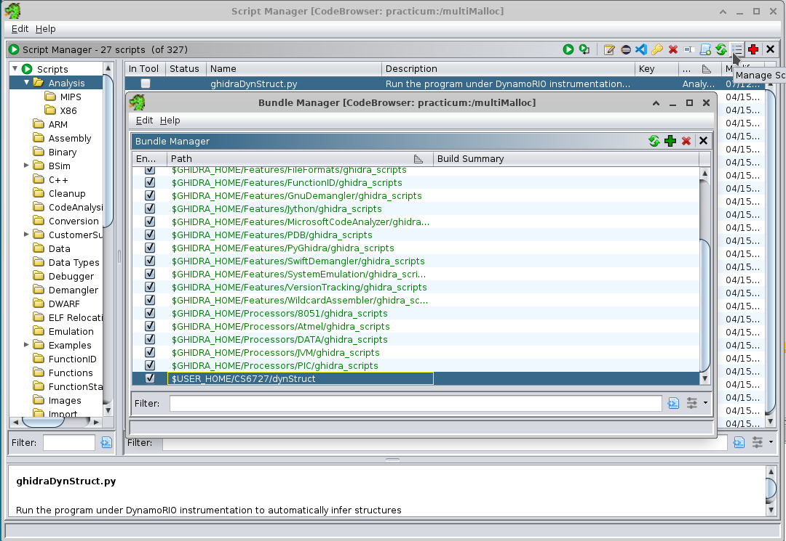
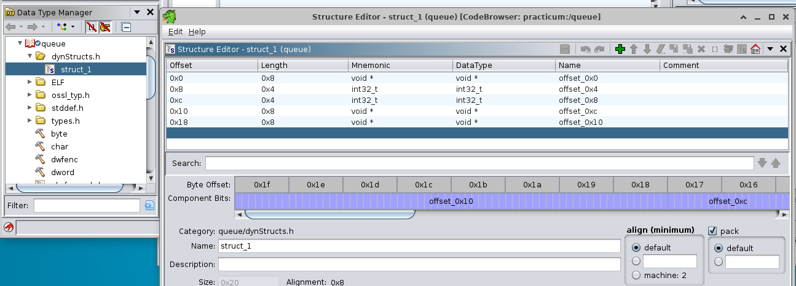
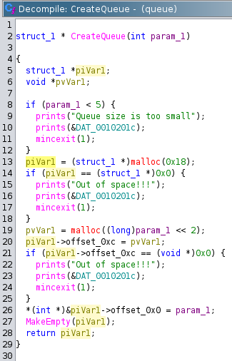

# ghidraDynStruct
ghidraDynStruct is a tool that uses dynamoRio to monitor memory accesses of an ELF binary via a data gatherer,
and uses this data to recover structures of the original code and edit the Ghidra decompilation accordingly.

This tool is a fork of [dynStruct](https://github.com/ampotos/dynStruct), which uses DynamoRIO to make a web UI that a user can query for structure information.

ghidraDynStruct is designed to run exclusively as a Ghidra script.

## Requirements
* [Ghidra](https://github.com/NationalSecurityAgency/ghidra). This project was built to run on Ghidra 11.3, but should have no problems running on older versions.
* CMake >= 2.8
* [DynamoRIO](https://github.com/DynamoRIO/dynamorio) : ghidraDynStruct has been tested against version 11.90, which is the most recent built as of July 2025. Any recent-ish version should work fine. The original dynStruct project was built against version 7.91.18109.

## Setup
Download DynamoRIO and install in a known location.
In Ghidra, import a binary you would like to analyze. Then open the script manager and add the directory for ghidraDynStruct.
Refresh the scripts list, and `ghidraDynStruct.py` should appear. Simply press the play button to run the script. The script will first ask for the location of the DynamoRIO root directory, and will then run both stages.



## How it Works
There are two stages to ghidraDynStruct - a dynamic stage and a static stage.

### Dynamic Stage
In the dynamic stage, `ghidraDynStruct` runs the program under DynamoRIO instrumentation, with a custom module attached. This custom module is built from the `src` and `include` directories, and if it has not been compiled when the script is first run, then the script will begin by compiling the module.

This custom module tracks every instance of `malloc`, `alloc`, `calloc`, and `free`, along with every read and write to a location that was previously alloc'd. All of these accesses are recorded and stored in a JSON output file.

Here's a snippet of a JSON output, from the `queue` benchmark:
<details>
<summary>Click to expand</summary>

```
"blocks":[
    {"start":126297881707168, 
    "end":126297881707192, 
    "size":24, 
    "free":0, 
    "alloc_by_realloc":0, 
    "free_by_realloc":0, 
    "alloc_pc":126297881686539, 
    "alloc_func":126297881686473, 
    "alloc_sym":"CreateQueue", 
    "alloc_module":"queue", 
    "free_pc":0, 
    "free_func":0, 
    "free_sym":"", 
    "free_module":"", 
    "read_access" : [
        {"offset":12, "total_access" : 122, "details":[
            {"size_access":4, "nb_access":20, "pc":126297881686454, "func_pc":126297881686438, "func_sym":"IsFull", "func_module":"queue", "opcode":"8b500c", "ctx_addr":126297881686457, "ctx_opcode":"488b45f8"}, 
            {"size_access":4, "nb_access":20, "pc":126297881686889, "func_pc":126297881686808, "func_sym":"Enqueue", "func_module":"queue", "opcode":"8b400c", "ctx_addr":126297881686892, "ctx_opcode":"8d5001"}, 
            {"size_access":4, "nb_access":20, "pc":126297881687147, "func_pc":126297881687069, "func_sym":"Dequeue", "func_module":"queue", "opcode":"8b400c", "ctx_addr":126297881687150, "ctx_opcode":"8d50ff"}, 
            {"size_access":4, "nb_access":62, "pc":126297881686425, "func_pc":126297881686409, "func_sym":"IsEmpty", "func_module":"queue", "opcode":"8b400c", "ctx_addr":126297881686428, "ctx_opcode":"85c0"}, 
            {}]}, 
        {"offset":16, "total_access" : 41, "details":[
            {"size_access":8, "nb_access":1, "pc":126297881686627, "func_pc":126297881686473, "func_sym":"CreateQueue", "func_module":"queue", "opcode":"488b4010", "ctx_addr":126297881686631, "ctx_opcode":"4885c0"}, 
            {"size_access":8, "nb_access":20, "pc":126297881686934, "func_pc":126297881686808, "func_sym":"Enqueue", "func_module":"queue", "opcode":"488b5010", "ctx_addr":126297881686938, "ctx_opcode":"488b45f0"}, 
            {"size_access":8, "nb_access":20, "pc":126297881686998, "func_pc":126297881686962, "func_sym":"Front", "func_module":"queue", "opcode":"488b5010", "ctx_addr":126297881687002, "ctx_opcode":"488b45f8"}, 
            {}]}, 
        {}
    ],
    "write_access" : [
        {"offset":16, "total_access" : 1, "details":[
            {"size_access":8, "nb_access":1, "pc":126297881686619, "func_pc":126297881686473, "func_sym":"CreateQueue", "func_module":"queue", "opcode":"48895010", "ctx_addr":126297881686615, "ctx_opcode":"488b45f8"}, 
            {}]}, 
        {"offset":0, "total_access" : 1, "details":[
            {"size_access":4, "nb_access":1, "pc":126297881686683, "func_pc":126297881686473, "func_sym":"CreateQueue", "func_module":"queue", "opcode":"8910", "ctx_addr":126297881686680, "ctx_opcode":"8b55ec"}, 
            {}]}, 
```
</details>

### Static Stage
In the static stage, `ghidraDynStruct` parses this JSON output and makes queries against the Ghidra listing to infer the type of each accessed element within a structure (e.g. `func*`, `struct*`, `array`, `int`, `str`, etc.). It then adds these inferred structures to the Ghidra Data Type Manager under the `dynStructs.h` heading.



Finally, the script edits the decompilation view directly to change the type of the result of each `malloc` call to the appropriate struct pointer. It also prints the address of each structure's allocation to the Ghidra console.



## Future Work
The static stage currently works by first defining a C header and then parsing that header with Ghidra. But this is quite inefficient, especially given that we are inferring structs from Ghidra calls anyway. A better way to do it would be to define the structures as we go, rather then defining the header and parsing the header. I've done it this way for simplicity's sake, but simple is not always best.
